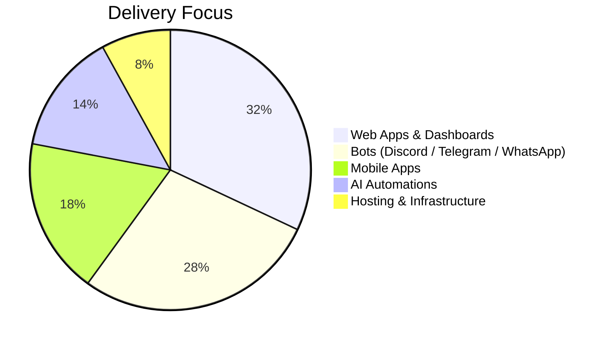

  
  <h1>DRANGULA DEVELOPMENT FZE LLC</h1>
  
<b>High-end web, mobile, bots, hosting, and AI automations — built in Node.js (TypeScript / JavaScript).</b>

  

    
    
    
  

  

    
    
    
  

---

<table>
  <tr>
    <td width="50%" valign="top">
      <h2>⚡ What we build</h2>
      <ul>
        <li><b>Websites</b> & premium landing pages</li>
        <li><b>Web apps</b> (dashboards, admin panels, SaaS)</li>
        <li><b>Mobile apps</b> (iOS & Android)</li>
        <li><b>Discord bots</b></li>
        <li><b>Telegram bots</b></li>
        <li><b>WhatsApp bots</b></li>
        <li><b>AI automations</b></li>
        <li><b>Hosting</b></li>
      </ul>
    </td>
    <td width="50%" valign="top">
      <h2>💎 Delivery standard</h2>
      
<b>Design</b> Premium UI/UX & brand consistency

      
<b>Engineering</b> Scalable, secure, production-ready systems

      
<b>Shipping</b> Deployment, monitoring, maintainability

      <h3>🔷 Core stack</h3>
      

        
        
        
        
        
        
      

    </td>
  </tr>
</table>

---

## 📊 Capability Focus

---

## 📈 GitHub Activity

  
  

---

## 🏢 Company

Legal name: Drangula Development FZE LLC
License Number: 262782464888
Executive Director: Dragan Milinković
Location: United Arab Emirates

---

## 📬 Contact

Website: https://www.drangula.net
Email: hi@drangula.net
Telegram: https://t.me/drangula

Built for scale. Designed to last. Delivered professionally.
